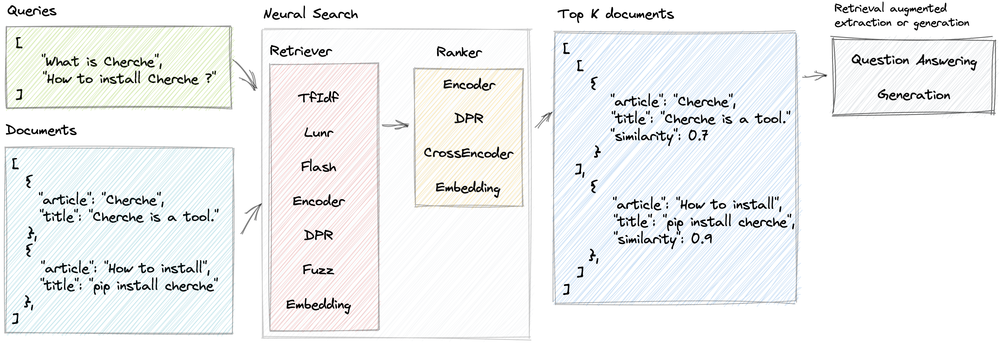

<div align="center">
  <h1>Cherche</h1>
  <p>Neural search</p>
</div>
<br>

<div align="center">
  <!-- Documentation -->
  <a href="https://raphaelsty.github.io/cherche/"></a>
  <!-- Demo -->
  <a href="https://huggingface.co/spaces/raphaelsty/games"></a>
  <!-- License -->
  <a href="https://opensource.org/licenses/MIT"></a>
</div>
<br>

Cherche allows the creation of efficient neural search pipelines using retrievers and pre-trained language models as rankers. Cherche's main strength is its ability to build diverse and end-to-end pipelines from lexical matching, semantic matching, and collaborative filtering-based models.



## Installation 🤖

```sh
pip install cherche --upgrade
```

To install the development version:

```sh
pip install git+https://github.com/raphaelsty/cherche
```

## [Documentation](https://raphaelsty.github.io/cherche/) 📜

Documentation is available [here](https://raphaelsty.github.io/cherche/). It provides details
about retrievers, rankers, pipelines, question answering, summarization, and examples.

## QuickStart 💨

### Documents 📑

Cherche allows findings the right document within a list of objects. Here is an example of a corpus.

```python
from cherche import data

documents = data.load_towns()

documents[:3]
[{'id': 0,
  'title': 'Paris',
  'url': 'https://en.wikipedia.org/wiki/Paris',
  'article': 'Paris is the capital and most populous city of France.'},
 {'id': 1,
  'title': 'Paris',
  'url': 'https://en.wikipedia.org/wiki/Paris',
  'article': "Since the 17th century, Paris has been one of Europe's major centres of science, and arts."},
 {'id': 2,
  'title': 'Paris',
  'url': 'https://en.wikipedia.org/wiki/Paris',
  'article': 'The City of Paris is the centre and seat of government of the region and province of Île-de-France.'
  }]
```

### Retriever ranker 🔍

Here is an example of a neural search pipeline composed of a TF-IDF that quickly retrieves documents, followed by a ranking model. The ranking model sorts the documents produced by the retriever based on the semantic similarity between the query and the documents.

```python
from cherche import data, retrieve, rank
from sentence_transformers import SentenceTransformer

# List of dicts
documents = data.load_towns()

# Retrieve on fields title and article
retriever = retrieve.TfIdf(key="id", on=["title", "article"], documents=documents, k=30)

# Rank on fields title and article
ranker = rank.Encoder(
    key = "id",
    on = ["title", "article"],
    encoder = SentenceTransformer("sentence-transformers/all-mpnet-base-v2").encode,
    k = 3,
)

# Pipeline creation
search = retriever + ranker

search.add(documents=documents)

search("Bordeaux")
[{'id': 57, 'similarity': 0.69513476},
 {'id': 63, 'similarity': 0.6214991},
 {'id': 65, 'similarity': 0.61809057}]
```

Map the index to the documents to access their contents.

```python
search += documents
search("Bordeaux")
[{'id': 57,
  'title': 'Bordeaux',
  'url': 'https://en.wikipedia.org/wiki/Bordeaux',
  'article': 'Bordeaux ( bor-DOH, French: [bɔʁdo] (listen); Gascon Occitan: Bordèu [buɾˈðɛw]) is a port city on the river Garonne in the Gironde department, Southwestern France.',
  'similarity': 0.69513476},
 {'id': 63,
  'title': 'Bordeaux',
  'url': 'https://en.wikipedia.org/wiki/Bordeaux',
  'article': 'The term "Bordelais" may also refer to the city and its surrounding region.',
  'similarity': 0.6214991},
 {'id': 65,
  'title': 'Bordeaux',
  'url': 'https://en.wikipedia.org/wiki/Bordeaux',
  'article': "Bordeaux is a world capital of wine, with its castles and vineyards of the Bordeaux region that stand on the hillsides of the Gironde and is home to the world's main wine fair, Vinexpo.",
  'similarity': 0.61809057}]
```

## Retrieve 👻

Cherche provides different [retrievers](https://raphaelsty.github.io/cherche/retrieve/retrieve/) that filter input documents based on a query.

- retrieve.Elastic
- retrieve.TfIdf
- retrieve.Lunr
- retrieve.BM25Okapi
- retrieve.BM25L
- retrieve.Flash
- retrieve.Encoder
- retrieve.DPR
- retrieve.Fuzz
- retrieve.Meilisearch
- retrieve.TypeSense
- retrieve.Recommend

## Rank 🤗

Cherche rankers are compatible with [SentenceTransformers](https://www.sbert.net/docs/pretrained_models.html) models, [Hugging Face sentence similarity](https://huggingface.co/models?pipeline_tag=zero-shot-classification&sort=downloads) models, [Hugging Face zero shot classification](https://huggingface.co/models?pipeline_tag=zero-shot-classification&sort=downloads) models, and of course with your own models.

## Batch

Batch processing is coming soon. Already available with Tf-Idf retriever.

## Summarization and question answering

Cherche provides modules dedicated to summarization and question answering. These modules are compatible with Hugging Face's pre-trained models and fully integrated into neural search pipelines.

## Translation

Hugging Face's translation models can be fully integrated into the neural search pipeline to translate queries, documents, or answers.

## Collaborative filtering

Search is fully compatible with the collaborative filtering library [Implicit](https://github.com/benfred/implicit). It is advantageous if you have a history associated with users and you want to retrieve / re-rank documents based on user preferences.

|            | **Document 1** | **Document 2** | **Document 3** | **Document 4** |
|:----------:|:--------------:|:--------------:|:--------------:|:--------------:|
| **User 1** |        1       |        0       |        0       |        1       |
| **User 2** |        0       |        1       |        0       |        0       |
| **User 3** |        0       |        4       |        1       |        0       |


## Deploy

We provide a minimalist API to deploy our neural search pipeline with FastAPI and Docker; information is available in the [documentation](https://raphaelsty.github.io/cherche/deployment/deployment/).

## Hugging Face Space

A running demo is available on [Hugging Face](https://huggingface.co/spaces/raphaelsty/games).

## Contributors 🤝
 Cherche was created for/by Renault and is now available to all.
 We welcome all contributions.

 <p align="center"></p>

## Acknowledgements 👏

The BM25 models available in Cherche are wrappers around [rank_bm25](https://github.com/dorianbrown/rank_bm25). Elastic retriever is a wrapper around [Python Elasticsearch Client](https://elasticsearch-py.readthedocs.io/en/v7.15.2/). TfIdf retriever is a wrapper around [scikit-learn's TfidfVectorizer](https://scikit-learn.org/stable/modules/generated/sklearn.feature_extraction.text.TfidfVectorizer.html). Lunr retriever is a wrapper around [Lunr.py](https://github.com/yeraydiazdiaz/lunr.py). Flash retriever is a wrapper around [FlashText](https://github.com/vi3k6i5/flashtext). DPR and Encode rankers are wrappers dedicated to the use of the pre-trained models of [SentenceTransformers](https://www.sbert.net/docs/pretrained_models.html) in a neural search pipeline. ZeroShot ranker is a wrapper dedicated to the use of the zero-shot sequence classifiers of [Hugging Face](https://huggingface.co/models?pipeline_tag=zero-shot-classification&sort=downloads) in a neural search pipeline.

## See also 👀

Cherche is a minimalist solution and meets a need for modularity. Cherche is the way to go if we start with a list of documents as JSON with multiple fields to search on and create pipelines. Also, Cherche is well suited for middle-sized corpora.

Do not hesitate to look at Jina, Haystack, or TxtAi, which offer advanced neural search solutions.

- [Haystack](https://github.com/deepset-ai/haystack)
- [Jina](https://github.com/jina-ai/jina)
- [txtai](https://github.com/neuml/txtai)

## Citations

If you use cherche to produce results for your scientific publication, please refer to our SIGIR paper:

```
@inproceedings{Sourty2022sigir,
    author = {Raphael Sourty and Jose G. Moreno and Lynda Tamine and Francois-Paul Servant},
    title = {CHERCHE: A new tool to rapidly implement pipelines in information retrieval},
    booktitle = {Proceedings of SIGIR 2022},
    year = {2022}
}
```

## Dev Team 💾

The Cherche dev team is made up of [Raphaël Sourty](https://github.com/raphaelsty), [François-Paul Servant](https://github.com/fpservant), [Nicolas Bizzozzero](https://github.com/NicolasBizzozzero), [Jose G Moreno](https://scholar.google.com/citations?user=4BZFUw8AAAAJ&hl=fr). 🥳
